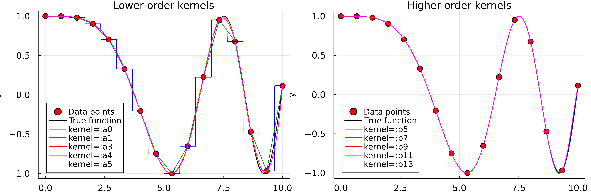
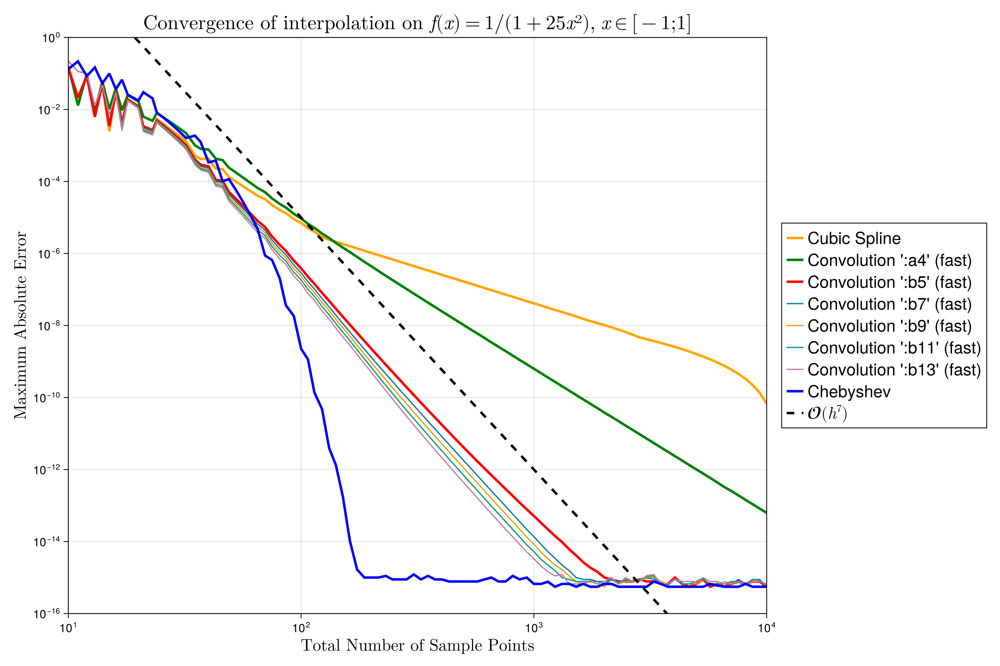
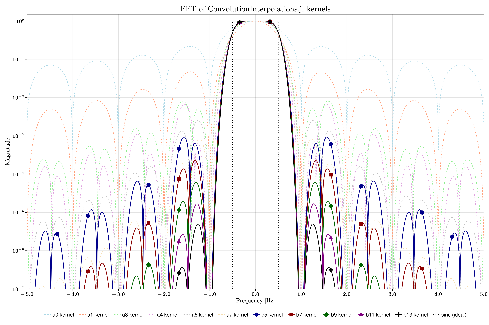
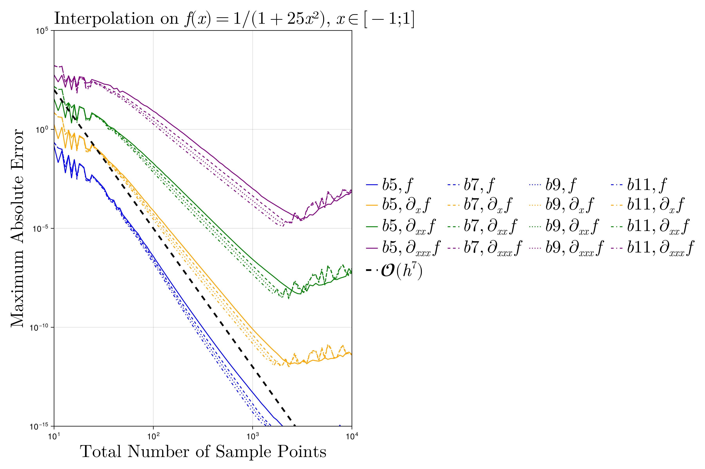

# ConvolutionInterpolations.jl

High-performance smooth N-dimensional interpolation on uniform grids using separable convolution kernels.

[](fig/convolution_interpolation_kernels.png)

## Why ConvolutionInterpolations.jl?

- **O(1) evaluation**: Interpolation time is independent of grid size, with allocation-free evaluation
- **7th order convergence**: The default `:b5` kernel significantly exceeds cubic spline accuracy at comparable cost
- **Uniform grids**: Spacing can differ between dimensions but must be uniform within each
- **N-dimensional**: Separable kernel design scales naturally from 1D to arbitrary dimensions
- **Simple API**: A single interface covers nearest-neighbor through 13th-degree polynomial kernels

## Installation

```julia
using Pkg
Pkg.add("ConvolutionInterpolations")
```

## Quick Start

### 1D Interpolation

```julia
using ConvolutionInterpolations
using Plots

# Sparse sampling: 3 samples per period
x = range(0, 2π, length=4)
y = sin.(x)
itp = convolution_interpolation(x, y)

x_fine = range(0, 2π, length=200)
p1 = plot(x_fine, sin.(x_fine), label="True function: sin(x)")
scatter!(p1, x, y, label="3 samples per period")
plot!(p1, x_fine, itp.(x_fine), label="Interpolated (3 samples)")

# Slightly denser: 4 samples per period
x = range(0, 2π, length=5)
y = sin.(x)
itp = convolution_interpolation(x, y)

p2 = plot(x_fine, sin.(x_fine), label="True function: sin(x)")
scatter!(p2, x, y, label="4 samples per period")
plot!(p2, x_fine, itp.(x_fine), label="Interpolated (4 samples)")

plot(p1, p2, layout=(1,2), size=(800,300), dpi=1000)
```

[](fig/simple_sine_wave_1D_demonstration.png)

### 2D Interpolation

```julia
using Random
using ConvolutionInterpolations
using Plots

Random.seed!(123)
xs = range(-2, 2, length=10)
ys = range(-2, 2, length=10)
zs = rand(10, 10)

itp_2d = convolution_interpolation((xs, ys), zs)

xs_fine = range(-2, 2, length=100)
ys_fine = range(-2, 2, length=100)

p1 = contourf(xs, ys, zs', title="Original Data")
p2 = contourf(xs_fine, ys_fine, itp_2d.(xs_fine, ys_fine')', title="Interpolated")
plot(p1, p2, layout=(1,2), size=(800,300), dpi=1000)
```

[](fig/Smooth_random_2D_interpolation.png)

## Accuracy

### Runge Function Benchmark

The 1D Runge function demonstrates convergence behavior across kernel families:

[](fig/interpolation_1d_runge.png)

- b5 reaches machine precision (~10⁻¹⁴) by 1000 sample points
- All b-series kernels show 7th order convergence (slope ≈ -7 on the log-log plot), compared to 4th order for cubic splines
- The discretized kernel approach is both faster and more numerically stable than direct polynomial evaluation
- Chebyshev interpolation shown for reference (requires non-uniform grid points)

### Frequency Response

The `:b`-series kernels approximate the ideal sinc interpolation kernel more closely than previously published convolution kernels, with flatter passbands and steeper stopband rolloff.

[](fig/FFT_kernels_spectra.png)

## Speed

Performance across dimensions and kernel families:

[](fig/kernel_performance_comparison.png)

**Initialization** (left panel): One-time setup cost, dominated by boundary condition computation. Ranges from ~76 μs for linear kernels to ~91 ms for 4D `:b13`.

**Evaluation** (right panel): Cost per interpolation call. Representative `:b5` timings:
- 1D: 15 ns
- 2D: 88 ns
- 3D: 1.8 μs

Evaluation cost scales as (2×eqs)ᴺ across dimensions due to tensor product structure.

Benchmarks use linear subgrid interpolation. Cubic and quintic subgrids improve accuracy but add overhead from additional tensor products per cell.

## Kernel Reference

### Available Kernels

| Kernel | Degree | Continuity | Max derivative | Convergence | Poly. reproduction | eqs |
|--------|--------|------------|----------------|-------------|--------------------|-----|
| `:a0`  | 0      | —          | —              | 1st order   | 0th                | 1   |
| `:a1`  | 1      | C⁰         | —              | 2nd order   | 1st                | 1   |
| `:a3`  | 3      | C¹         | —              | ~3rd order  | 2nd                | 2   |
| `:a4`  | 3      | C¹         | —              | ~4th order  | 3rd                | 3   |
| `:a5`  | 5      | C¹         | —              | ~3rd order  | 2nd                | 3   |
| `:a7`  | 7      | C¹         | —              | ~3rd order  | 2nd                | 4   |
| `:b5`  | 5      | C²         | 2              | 7th order   | 14th               | 5   |
| `:b7`  | 7      | C³         | 3              | 7th order   | 16th               | 6   |
| `:b9`  | 9      | C⁴         | 4              | 7th order   | 17th               | 7   |
| `:b11` | 11     | C⁵         | 5              | 7th order   | 19th               | 8   |
| `:b13` | 13     | C⁵         | 5              | 7th order   | 20th               | 9   |

The b5 kernel is the default. Higher-degree b-series kernels provide additional smoothness while maintaining 7th order convergence. All b-series kernels reproduce polynomials far beyond their own degree.

Gaussian smoothing is also available via the `B` parameter, which does not interpolate data points exactly:
```julia
itp = convolution_interpolation(x, y; B=1.0)  # B controls smoothing width
```

### Boundary Conditions

Control how ghost point values are computed near domain edges:
```julia
itp = convolution_interpolation(x, y; kernel_bc=:auto)        # Default
itp = convolution_interpolation(x, y; kernel_bc=:polynomial)   # Optimal for b-series
itp = convolution_interpolation(x, y; kernel_bc=:detect)       # Periodic signal detection
itp = convolution_interpolation(x, y; kernel_bc=:linear)
itp = convolution_interpolation(x, y; kernel_bc=:quadratic)
itp = convolution_interpolation(x, y; kernel_bc=:periodic)
```

The default `:auto` prioritizes `:polynomial`, which preserves each kernel's polynomial reproduction properties at domain edges. It falls back to `:detect` when there are insufficient grid points.

Per-dimension and per-direction boundary conditions are supported:
```julia
kernel_bcs = [
    (:linear, :quadratic),   # First dimension: linear at start, quadratic at end
    (:periodic, :detect)     # Second dimension: periodic at start, detect at end
]
itp = convolution_interpolation((x, y), z; kernel_bc=kernel_bcs)
```

### Derivatives

Derivatives are computed through analytically differentiated kernel coefficients, providing stable results without step-size tuning.
```julia
x = range(0, 2π, length=100)
y = sin.(x)

itp_d1 = convolution_interpolation(x, y; derivative=1)  # cos(x)
itp_d2 = convolution_interpolation(x, y; derivative=2)  # -sin(x)
```

The maximum supported derivative order is determined by the kernel's continuity class (see [Kernel Reference](#available-kernels)).

In multiple dimensions, `derivative=1` applies the derivative kernel along all dimensions simultaneously, producing the mixed partial derivative:
```julia
# 2D mixed partial derivative ∂²f/∂x∂y
x = range(0, 2π, length=100)
y = range(0, 2π, length=100)
data = [sin(xi) * sin(yi) for xi in x, yi in y]
itp_d1 = convolution_interpolation((x, y), data; derivative=1)
itp_d1(1.0, 2.0)  # Returns cos(1.0) * cos(2.0)
```

[](fig/kernel_derivatives_1d_runge.png)

Approximately one order of convergence is lost per derivative order.

### Extrapolation

Define behavior outside the data domain:
```julia
itp = convolution_interpolation(x, y; extrapolation_bc=Throw())     # Error (default)
itp = convolution_interpolation(x, y; extrapolation_bc=Line())      # Linear
itp = convolution_interpolation(x, y; extrapolation_bc=Flat())      # Constant
itp = convolution_interpolation(x, y; extrapolation_bc=Periodic())  # Periodic extension
itp = convolution_interpolation(x, y; extrapolation_bc=Reflect())   # Reflection
itp = convolution_interpolation(x, y; extrapolation_bc=Natural())   # Smooth boundary preservation
```

The `Natural()` mode transforms extrapolation into interpolation by expanding the domain with boundary coefficients before applying linear extrapolation. This preserves the kernel's full smoothness across the boundary region, rather than abruptly transitioning at the domain edge.

### High-Dimensional Interpolation
```julia
# 4D interpolation (e.g., time-evolving 3D scalar field)
x = range(0, 1, length=10)
y = range(0, 1, length=10)
z = range(0, 1, length=10)
t = range(0, 1, length=5)

data_4d = [sin(2π*xi)*cos(2π*yi)*exp(-zi)*sqrt(ti) 
           for xi in x, yi in y, zi in z, ti in t]

itp_4d = convolution_interpolation((x, y, z, t), data_4d)
itp_4d(0.42, 0.33, 0.77, 0.51)
```

The separable kernel design scales to arbitrary dimensions.

### Subgrid Interpolation

The fast evaluation mode convolves data with precomputed kernel values, then interpolates between convolution results. The `subgrid` parameter controls this inner interpolation:
```julia
itp = convolution_interpolation(x, y; subgrid=:cubic)                    # Default, highest accuracy
itp = convolution_interpolation(x, y; subgrid=:quintic)                  # Even higher accuracy
itp = convolution_interpolation(x, y; subgrid=:linear, precompute=10_000) # Fastest evaluation
```

| Subgrid    | Method               | Kernel derivatives used | Speed   | Accuracy |
|------------|----------------------|------------------------|---------|----------|
| `:linear`  | Linear interpolation | 0                      | Fastest | Lowest   |
| `:cubic`   | Cubic Hermite        | 1                      | Middle  | High     |
| `:quintic` | Quintic Hermite      | 2                      | Slowest | Highest  |

Cubic and quintic subgrids use analytically predifferentiated kernels for Hermite interpolation, achieving high accuracy with far fewer precomputed points than linear subgrid requires. The default `:cubic` with `precompute=100` is a good starting point. For linear subgrid, increase `precompute` to at least 10,000.

The available subgrid order depends on remaining smooth derivatives: `max_derivative[kernel] - derivative`. For example, b5 with `derivative=2` has no remaining derivatives, so only `:linear` is available.

Cubic and quintic subgrids are implemented for 1D and 2D. Higher dimensions use `:linear` subgrid, as tensor products per cell grow as `(order+1)ᴺ`.

Benchmarks in the [Speed](#speed) section use `:linear` subgrid.

## Performance Guidelines

- **Default to `:b5`**: Best balance of accuracy and cost
- **Higher b-kernels for smoothness**: b7 through b13 maintain 7th order convergence with increasingly smooth derivatives
- **Use `:a` kernels if construction time matters**: b-series boundary handling adds initialization overhead on fine grids
- **Lower degrees in high dimensions**: Boundary handling overhead grows with dimension; simpler kernels keep initialization fast in 4D+

## Technical Background

This package introduces three main contributions:

**B-series kernel family.** A new family of high-order convolution kernels (b5, b7, b9, b11, b13) discovered through systematic analytical search using symbolic computation (SymPy), generalizing the approach of R. G. Keys (1981). All b-series kernels achieve 7th order convergence with polynomial reproduction far exceeding their own degree. Kernel coefficients are stored as exact rational numbers, enabling extended precision arithmetic with BigFloat.

**Hermite multilevel interpolation.** Rather than evaluating kernel polynomials directly, kernels are discretized at a small number of points (default 100) and cached to disk via Scratch.jl. During evaluation, data is convolved with these precomputed values, and the results are interpolated using cubic or quintic Hermite subgrid interpolation. This approach is both faster and more numerically stable than direct polynomial evaluation.

**Polynomial boundary conditions.** A boundary handling method that computes optimal ghost point values that preserve each kernel's polynomial reproduction properties. This maintains convergence order across the entire domain rather than degrading near boundaries.

## Comparison with Other Packages

Key differences from existing interpolation packages:

- B-series kernels with 7th order convergence on uniform grids
- Persistent kernel caching for near-instant subsequent initialization
- Hermite multilevel interpolation for combined speed and stability
- Single interface from nearest-neighbor to 13th-degree kernels
- Minimal dependencies (LinearAlgebra, Serialization, Scratch.jl)

## Acknowledgments

ConvolutionInterpolations.jl draws significant inspiration from [Interpolations.jl](https://github.com/JuliaMath/Interpolations.jl) in terms of API design and interface patterns. This package originally started as a PR for Interpolations.jl before evolving into a standalone implementation.

The theoretical foundation builds on:

- R. G. Keys, "Cubic Convolution Interpolation for Digital Image Processing," *IEEE Trans. Acoustics, Speech, and Signal Processing*, vol. 29, no. 6, 1981.
- E. H. W. Meijering, K. J. Zuiderveld, and M. A. Viergever, "Image Reconstruction by Convolution with Symmetrical Piecewise nth-Order Polynomial Kernels," *IEEE Trans. Image Processing*, vol. 8, no. 2, 1999.

## Declaration of AI Assistance

Parts of this package and its documentation were developed with assistance from Claude (Anthropic). All code, methods, and scientific content have been verified and validated by the author.