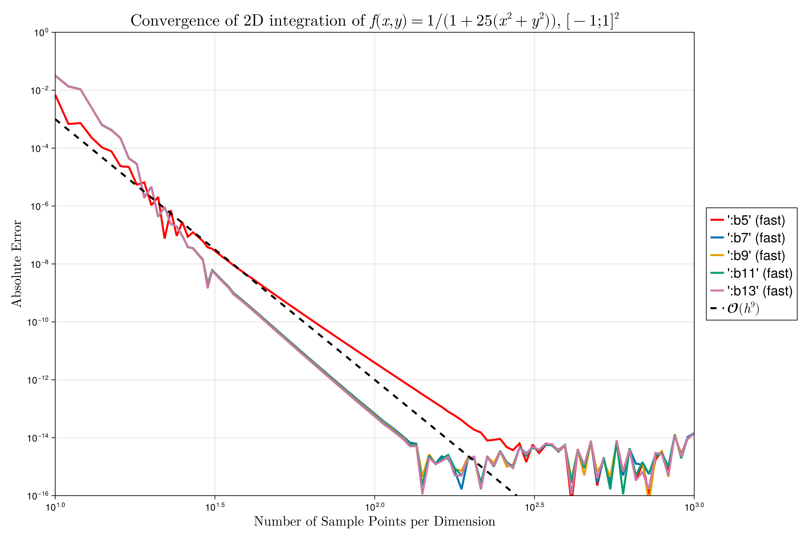

# ConvolutionInterpolations.jl

Smooth interpolation, derivatives and antiderivatives from a discrete grid of samples.

[](fig/convolution_interpolation_kernels.png)

## Why ConvolutionInterpolations.jl?

- **High accuracy by default**: The default `:b5` kernel gives 7th-order convergence
- **Uniform grids**: Uniform grids use optimized precomputed kernels
- **Non-uniform grids**: Non-uniform grids are detected automatically
- **O(1) evaluation (uniform)**: Query time is independent of grid size with allocation-free evaluation
- **N-dimensional**: Separable kernel design scales naturally from 1D to arbitrary dimensions
- **Simple API**: A single interface covers nearest-neighbor through 13th-degree polynomial kernels
- **Derivatives up to 6th order**: Analytically differentiated kernels, stable and allocation-free
- **Antiderivative support (uniform)**: Compute 7th order accurate smooth indefinite integrals

## Installation

```julia
using Pkg
Pkg.add("ConvolutionInterpolations")
```

## Quick Start

### 1D Interpolation

```julia
using ConvolutionInterpolations, Plots

# Sparse sampling: 4 samples sine wave
x = range(0, 2π, length=4)
y = sin.(x)
itp = convolution_interpolation(x, y);  # default :b5 kernel

x_fine = range(0, 2π, length=200)
p1 = plot(x_fine, sin.(x_fine), label="True function: sin(x)")
scatter!(p1, x, y, label="4 samples")
plot!(p1, x_fine, itp.(x_fine), label="Interpolated (4 samples)")
```

[](fig/simple_sine_wave_1D_demonstration.png)

### 2D Interpolation

```julia
using ConvolutionInterpolations, Plots

xs = range(-π, π, length=5)
ys = range(-π, π, length=5)
zs = sin.(xs) .* sin.(ys')

itp_2d = convolution_interpolation((xs, ys), zs);

xs_fine = range(-π, π, length=100)
ys_fine = range(-π, π, length=100)

p1 = contourf(xs, ys, zs', title="Original Data")
p2 = contourf(xs_fine, ys_fine, itp_2d.(xs_fine, ys_fine')', title="Interpolated")
plot(p1, p2, layout=(1,2), size=(800,300))
```

[](fig/smooth_2D_interpolation.png)

### Non-uniform Grid Interpolation

Non-uniform grids are detected automatically.
The `:a0` (nearest) and `:a1` (linear) kernels work natively on non-uniform grids.
Higher `:a` kernels (`:a3` through `:a7`) fall back to the `:n3` kernel, which uses
cubic weights equivalent to non-uniform Catmull-Rom splines with 3rd order convergence.

For higher accuracy and derivatives, the `:b` kernels (`:b5` through `:b13`) can be used.
The maximum derivative order depends on the kernel's continuity class (see [Available Kernels](#available-kernels)).
Per-interval weight polynomials are precomputed using exact rational arithmetic.

```julia
x = [0.0, 0.15, 0.4, 0.7, 1.5, 2.5, 3.8, 4.2, 4.6, 4.8, 5.0,
     5.3, 5.6, 6.0, 6.5, 7.0, 7.3, 7.8, 8.2, 8.5, 9.0, 9.5, 10.0]
y = sin.(x) .* exp.(-x/5)

itp   = convolution_interpolation(x, y; kernel=:b11);                # f(x)
itp_d1 = convolution_interpolation(x, y; kernel=:b11, derivative=1);  # f'(x)
itp_d2 = convolution_interpolation(x, y; kernel=:b11, derivative=2);  # f''(x)
itp_d3 = convolution_interpolation(x, y; kernel=:b11, derivative=3);  # f'''(x)
itp_d4 = convolution_interpolation(x, y; kernel=:b11, derivative=4);  # f⁴(x)
itp_d5 = convolution_interpolation(x, y; kernel=:b11, derivative=5);  # f⁵(x)
```

[](fig/nonuniform_derivatives.png)

Dots are analytical values, solid lines are the `:b11` interpolant.
Non-uniform interpolation works in any number of dimensions via tensor products.
Non-uniform precomputation scales with the number of intervals; for performance-critical applications, 
non-uniform kernels can be used once to resample data onto a uniform grid, 
then efficient uniform kernels can be used for repeated evaluation.

### Scattered Data

For truly scattered (unstructured) data, resample onto a uniform grid first using a package such as [ScatteredInterpolation.jl](https://github.com/eljungsk/ScatteredInterpolation.jl), then apply ConvolutionInterpolations.jl for high-order evaluation:
```julia
using ScatteredInterpolation, ConvolutionInterpolations

# Scattered data
points = rand(2, 500) .* 2π
values = sin.(points[1,:]) .* cos.(points[2,:])

# Resample to uniform grid via RBF
itp_rbf = interpolate(Multiquadratic(), points, values)
xs = ys = range(0, 2π, length=100)
grid_values = [evaluate(itp_rbf, [x, y])[1] for x in xs, y in ys]

# High-order evaluation, derivatives, and antiderivatives on the uniform grid
itp = convolution_interpolation((xs, ys), grid_values; kernel=:b7)
```

## Accuracy

### Runge Function Benchmark

The 1D Runge function demonstrates convergence behavior across kernel families:

[](fig/convergence_interpolation_1d_runge.png)

- `:b` kernels reach machine precision (~10⁻¹⁴) by 1000 sample points
- `:b`-series kernels show 7th order convergence (slope ≈ -7 on the log-log plot)
- The `:a4` kernel show 4th order convergence, and is similar to cubic splines
- The discretized kernel approach is both faster and more numerically stable than direct polynomial evaluation
- Chebyshev interpolation shown for reference (requires non-uniform grid points)

### Frequency Response

The `:b`-series kernels approximate the ideal sinc interpolation kernel more closely than previously published convolution kernels, with flatter passbands and steeper stopband rolloff.

[](fig/FFT_kernels_spectra.png)

## Speed

Performance across dimensions and kernel families:

[](fig/kernel_performance_comparison.png)

**Initialization** (left panel): One-time setup cost in eager mode (`lazy=false`). Ranges from ~2 μs for linear kernels to ~4 s for 4D `:b` kernels. For kernels higher than `:a1`, setup time scales with the number of boundary points. Benchmarks use 100 grid points per dimension (100, 100², 100³, 100⁴). With `lazy=true`, construction is constant-time (~0.12 ms) regardless of grid size or dimension — see [High-Dimensional Interpolation](#high-dimensional-interpolation) for benchmarks.

**Evaluation** (right panel): Cost per interpolation call with default settings (`:cubic` subgrid, extrapolation wrapper).

Lower times are achievable with lower order kernels, `:linear` subgrid or by bypassing the extrapolation wrapper (`itp.itp(x)`).

Evaluation cost scales as (stencil)ᴺ across dimensions due to tensor product structure.

## Kernel Reference

### Available Kernels

Uniform grid kernels

| Kernel | Degree | Continuity | Derivative range | Convergence | stencil |
|--------|--------|------------|------------------|-------------|-----|
| `:a0`  | 0      | —          | -1..0            | 1st order   | 2ᴺ   |
| `:a1`  | 1      | C⁰         | -1..0            | 2nd order   | 2ᴺ   |
| `:a3`  | 3      | C¹         | -1..1            | ~3rd order  | 4ᴺ   |
| `:a4`  | 3      | C¹         | -1..1            | ~4th order  | 6ᴺ   |
| `:a5`  | 5      | C¹         | -1..1            | ~3rd order  | 6ᴺ   |
| `:a7`  | 7      | C¹         | -1..1            | ~3rd order  | 8ᴺ   |
| `:b5`  | 5      | C³         | -1..3            | 7th order   | 10ᴺ   |
| `:b7`  | 7      | C⁴         | -1..4            | 7th order   | 12ᴺ   |
| `:b9`  | 9      | C⁵         | -1..5            | 7th order   | 14ᴺ   |
| `:b11` | 11     | C⁶         | -1..6            | 7th order   | 16ᴺ   |
| `:b13` | 13     | C⁶         | -1..6            | 7th order   | 18ᴺ   |

Non-uniform grid kernels

| Kernel | Degree | Continuity | Derivative range | Convergence | stencil |
|--------|--------|------------|------------------|-------------|-----|
| `:a0`  | 0      | —          | —                | 1st order   | 2ᴺ  |
| `:a1`  | 1      | C⁰         | 0..0             | 2nd order   | 2ᴺ  |
| `:n3`  | 3      | C¹         | 0..0             | ~3rd order  | 4ᴺ  |
| `:b5`  | 5      | C³         | 0..3             | 7th order   | 10ᴺ |
| `:b7`  | 7      | C⁴         | 0..4             | 7th order   | 12ᴺ |
| `:b9`  | 9      | C⁵         | 0..5             | 7th order   | 14ᴺ |
| `:b11` | 11     | C⁶         | 0..6             | 7th order   | 16ᴺ |
| `:b13` | 13     | C⁶         | 0..6             | 7th order   | 18ᴺ |

The default kernel is `:b5`, which provides 7th-order accuracy and C³ continuity.
It works across all modes: uniform, non-uniform, derivatives, antiderivative, lazy, and
arbitrary dimensions.

Gaussian smoothing, which does not interpolate data points exactly, is available via the `B` parameter:
```julia
itp = convolution_interpolation(x, y; B=1.0);  # B controls smoothing width
```

### Boundary Conditions

Control how ghost point values are computed near domain edges:
```julia
itp = convolution_interpolation(x, y; bc=:auto);        # Default
itp = convolution_interpolation(x, y; bc=:poly);   # Optimal for b-series
itp = convolution_interpolation(x, y; bc=:linear);
itp = convolution_interpolation(x, y; bc=:quadratic);
itp = convolution_interpolation(x, y; bc=:periodic);
```

The default `:auto` prioritizes `:poly`, which preserves each kernel's polynomial reproduction properties at domain edges.
It falls back to `:linear` when there are insufficient grid points.

Per-dimension and per-direction boundary conditions are supported:
```julia
bcs = [
    (:linear, :quadratic),   # First dimension: linear at start, quadratic at end
    (:periodic, :poly)     # Second dimension: periodic at start, polynomial at end
]
itp = convolution_interpolation((x, y), z; bc=bcs);
```

### Derivatives

Derivatives are computed through analytically differentiated kernel coefficients, providing stable results without step-size tuning.
```julia
x = range(0, 2π, length=100)
y = sin.(x)

itp_d1 = convolution_interpolation(x, y; derivative=1);  # cos(x)
itp_d2 = convolution_interpolation(x, y; derivative=2);  # -sin(x)
```

The maximum supported derivative order is determined by the kernel's continuity class (see [Kernel Reference](#available-kernels)).

In multiple dimensions, `derivative=1` applies the derivative kernel along all dimensions simultaneously, producing the mixed partial derivative:
```julia
# 2D mixed partial derivative ∂²f/∂x∂y
x = range(0, 2π, length=100)
y = range(0, 2π, length=100)
data = [sin(xi) * sin(yi) for xi in x, yi in y]
itp_d1 = convolution_interpolation((x, y), data; derivative=1);
itp_d1(1.0, 2.0)  # Returns cos(1.0) * cos(2.0)
```

[](fig/kernel_derivatives_1d_runge.png)

Approximately one order of convergence is lost per derivative order.

Switching from `subgrid=:cubic` (default) to `subgrid=:linear` makes one additional derivative order available.

Per-dimension derivative orders are supported by passing a tuple to `derivative`:
```julia
# d/dx only (derivative order 1 in x, 0 in y)
itp = convolution_interpolation((x, y), data; derivative=(1, 0))

# d²/dx² in x, d/dy in y
itp = convolution_interpolation((x, y), data; derivative=(2, 1))
```

Per-dimension kernels are also supported, allowing different accuracy/cost tradeoffs per axis:
```julia
itp = convolution_interpolation((x, y), data; kernel=(:b9, :b5))
```

This works on both uniform and non-uniform grids. On non-uniform grids, each dimension
independently selects its kernel and derivative order, and the ghost point arrays are
padded per-dimension by each kernel's own stencil radius.

### Antiderivative

Pass `derivative=-1` to compute the indefinite integral of the interpolant:

```julia
x = range(0.0, 2π, length=100)
y = sin.(x)

itp = convolution_interpolation(x, y; derivative=-1);
itp(1.0)   # ≈ 0.4597  (= 1 - cos(1), anchored at x=0)
```

The result is zero-anchored at the leftmost interior knot: `F(anchor) = 0` exactly.
The fast path (default) precomputes the anchor-side contribution at construction time,
so evaluation is zero-allocation and O(stencil) — the same cost as regular interpolation,
scaled by the wider kernel sum.

In N dimensions the result is the iterated antiderivative:

```julia
xs = range(0.0, 1.0, length=50)
ys = range(0.0, 1.0, length=50)
vs = [x + y for x in xs, y in ys]

itp2 = convolution_interpolation((xs, ys), vs; derivative=-1);
itp2(0.5, 0.5)   # ≈ ∫₀^0.5 ∫₀^0.5 (x+y) dx dy = 0.125
```

Antiderivative support is available for all uniform-grid kernels except `:a0`.
It is not yet supported on non-uniform grids. 

Mixed antiderivative/derivative orders are supported on uniform grids via a tuple,
enabling e.g. Leibniz-rule-style operations — integrate in one variable, differentiate in another:
```julia
xs = range(0.0, 2π, length=100)
ys = range(0.0, 2π, length=100)
vs = [sin(x) * cos(y) for x in xs, y in ys]

# ∂/∂x ∫ f dy  (differentiate x, integrate y)
itp = convolution_interpolation((xs, ys), vs; kernel=:b7, derivative=(1, -1))
itp(1.0, 2.0)  # ≈ cos(1.0) * sin(2.0)
```

The figure below shows convergence of the antiderivative of Runge's function:

[](fig/convergence_integration_1d_runge.png)

### Discontinuous Antiderivatives

The `:a0` kernel supports antiderivatives of piecewise constant and discontinuous functions.
A delta-like spike integrates to a Heaviside step:
```julia
using ConvolutionInterpolations, Plots

n = 1001
x = range(0.0, 2π, length=n)
h = x[2] - x[1]
y = [abs(xi - π) ≈ 0.0 ? 1.0/h : 0.0 for xi in x]

itp = convolution_interpolation(x, y; kernel=:a0, derivative=-1)

x_fine = range(0.0, 2π, length=500)
p1 = plot(x, y, title="Delta-like spike", lw=2, label="f(x)")
p2 = plot(x_fine, itp.(x_fine), title="∫f dx ≈ Heaviside", lw=2, label="F(x)")
plot!(x_fine, [xi < π ? 0.0 : 1.0 for xi in x_fine], lw=2, ls=:dash, label="exact")
plot(p1, p2, layout=(1,2), size=(900,400))
```

[](fig/delta_heaviside.png)

### Multidimensional Integration Convergence

For smooth functions, the tensor product structure of the antiderivative yields an empirical
convergence enhancement in higher dimensions. For b-series kernels on smooth integrands:

<p align="center"><b>O(h<sup>p</sup>),&nbsp;&nbsp;p = 7 + 2·(N−1)</b></p>

So 9th order in 2D, 11th order in 3D, and so on — all from the same 7th order 1D kernel.
For less smooth functions the order stays close to the 1D rate, but the absolute error
still decreases with dimension for a fixed number of points per dimension.

[](fig/convergence_integration_2d_runge.png)

All b-series kernels converge at the same ~9th order rate in 2D on smooth integrands,
reaching machine precision (~10⁻¹⁵) around 100 sample points per dimension.
The theoretical explanation for this dimensional enhancement remains an open question.

### Extrapolation

Define behavior outside the data domain:
```julia
itp = convolution_interpolation(x, y; extrap=:throw);     # Error (default)
itp = convolution_interpolation(x, y; extrap=:line);      # Linear
itp = convolution_interpolation(x, y; extrap=:flat);      # Constant
itp = convolution_interpolation(x, y; extrap=:natural);   # Smooth boundary preservation
```

The `:natural` mode transforms extrapolation into interpolation by expanding the domain with boundary coefficients before applying linear extrapolation. This preserves the kernel's full smoothness across the boundary region, rather than abruptly transitioning at the domain edge.
`:natural` is not recommended in high dimensions due to the double construction cost.

### High-Dimensional Interpolation

The separable kernel design scales to arbitrary dimensions.
For large three-dimensional grids or any four-dimensional and higher data, `lazy=true` is recommended.
This computes ghost points on the fly near boundaries, saving considerable setup time, at the expense of near boundary query times.

`lazy=true` requires a uniform grid. It is compatible with per-dimension kernel and derivative tuples:
```julia
itp = convolution_interpolation((x, y, z), data; kernel=(:b5, :b7, :b9), lazy=true, fast=false)
itp = convolution_interpolation((x, y, z), data; kernel=(:b5, :b7, :b9), derivative=(1, 0, 2), lazy=true, fast=false)
```

> **Note**: For very high dimensional data, `lazy=true` skips ghost point expansion at construction time. Near-boundary evaluation can be controlled independently via `boundary_fallback=true`, which linearly extrapolates from interior points rather than computing full ghost point stencils at boundaries. For exact interpolation across the entire domain, use `boundary_fallback=false` (default).

```julia
# 4D interpolation (e.g., time-evolving 3D scalar field)
x = range(0, 1, length=20)
y = range(0, 1, length=20)
z = range(0, 1, length=20)
t = range(0, 1, length=10)

data_4d = [sin(2π*xi)*cos(2π*yi)*exp(-zi)*sqrt(ti+0.1)
           for xi in x, yi in y, zi in z, ti in t]

itp_4d = convolution_interpolation((x, y, z, t), data_4d, lazy=true, kernel=:a3);
itp_4d(0.42, 0.33, 0.77, 0.51)
```

Interior evaluation is identical in lazy and eager modes.

#### Construction speedup with `lazy=true`

| Grid | `:a3` | `:a4` | `:b5` |
|------|------:|------:|------:|
| 3D 20³ | 3× | 3× | 3× |
| 3D 100³ | 96× | 102× | 104× |
| 4D 10⁴ | 7× | 11× | 22× |
| 4D 30⁴ | 248× | 252× | 349× |

Lazy construction is constant-time (~0.12 ms) regardless of grid size; eager scales with the number of boundary points.

#### Evaluation cost (4D 20⁴)

| Kernel | Interior | Boundary (eager) | Boundary (lazy + Line) |
|--------|----------|-------------------|------------------------|
| :a3 | 659 ns | 659 ns | 3.1 μs |
| :a4 | 3.2 μs | 3.2 μs | 8.2 μs |
| :b5 | 24 μs | 24 μs | 50 μs |

For `lazy=false` (eager mode), all boundary conditions and extrapolation options
remain available. Use this when exact boundary behavior is critical.

### Subgrid Interpolation

The fast evaluation mode convolves data with precomputed kernel values, then interpolates between convolution results. 
The `subgrid` parameter controls this inner interpolation:
```julia
itp = convolution_interpolation(x, y; subgrid=:cubic);                    # Default, high accuracy
itp = convolution_interpolation(x, y; subgrid=:quintic);                  # Even higher accuracy
itp = convolution_interpolation(x, y; subgrid=:linear, precompute=10_000); # Fastest evaluation
```

| Subgrid    | Method               | Kernel derivatives used | Speed   | Accuracy |
|------------|----------------------|------------------------|---------|----------|
| `:linear`  | Linear interpolation | 0                      | Fastest | Lowest   |
| `:cubic`   | Cubic Hermite        | 1                      | Middle  | High     |
| `:quintic` | Quintic Hermite      | 2                      | Slowest | Highest  |

Cubic and quintic subgrids use analytically predifferentiated kernels for Hermite interpolation, achieving high accuracy with far fewer precomputed points than linear subgrid requires. The default `:cubic` with `precompute=101` uses pre-shipped kernel tables requiring zero computation at startup. For linear subgrid, increase `precompute` to at least 10,000.

The available subgrid order depends on remaining smooth derivatives: `max_derivative[kernel] - derivative`. For example, b5 with `derivative=3` has no remaining derivatives, so only `:linear` is available.

Cubic and quintic subgrids are implemented for 1D and 2D. Higher dimensions use `:linear` subgrid, as tensor products per cell grow as `(order+1)ᴺ`.

Benchmarks in the [Speed](#speed) section use `:linear` subgrid.

## Performance Guidelines

- **Default `:b5` works everywhere**: 7th-order accuracy on uniform grids, non-uniform grids, high-order derivatives
- **Use `lazy=true` in high dimensions**: Skips ghost point expansion, reducing construction time and memory
- **Use `:a0`, `:a1` or `:a3` in high dimensions**: Evaluation time of narrower kernels scale better with dimensions
- **Pre-shipped kernel tables**: The default `precompute=101` with `:cubic` or `:quintic` subgrid loads precomputed constants
- **Orthogonal grids assumption**: The separable kernel design requires mutually orthogonal grid axes.

## Technical Background

This package introduces five main contributions:

**b-series kernel family.** A new family of high-order convolution kernels (b5, b7, b9, b11, b13) discovered through systematic analytical search using symbolic computation (SymPy), generalizing the approach of R. G. Keys (1981). All b-series kernels achieve 7th order convergence. Kernel coefficients are stored as exact rational numbers, enabling extended precision arithmetic with BigFloat.

**Hermite multilevel interpolation.** Rather than evaluating kernel polynomials directly, kernels are discretized at a small number of points (default 101) and shipped as package constants. Higher resolutions or non-standard precisions are computed on demand and cached to disk via Scratch.jl. During evaluation, data is convolved with these precomputed values, and the results are interpolated using cubic or quintic Hermite subgrid interpolation. This approach is both faster (`O(1)`) and more numerically stable than direct polynomial evaluation.

**Polynomial boundary conditions.** A boundary handling method that computes optimal ghost point values that preserve each kernel's polynomial reproduction properties. This maintains convergence order across the entire domain rather than degrading near boundaries.

**Non-uniform b-kernel extension.** On non-uniform grids, each interval requires its own weights adapted to the local grid geometry. This is achieved by expanding the kernel in a binomial series around each interval's local coordinate, then projecting through a Vandermonde system to enforce polynomial reproduction up to the kernel's design order. The result is a compact set of polynomial coefficients per interval, evaluated via Horner's method at query time. All weight generation uses exact `Rational{BigInt}` arithmetic to avoid floating-point contamination, with conversion to `Float64` only at the final storage step. The same framework extends to derivatives by applying the binomial expansion to analytically differentiated kernel coefficients. On mixed grids (some dimensions uniform, some not), each dimension independently
selects the appropriate path through the separable tensor product. Per-dimension kernels are supported on both uniform and non-uniform grids: ghost point
arrays are padded per-dimension by each kernel's own stencil radius, and derivative scaling factors are applied independently per axis.

**Antiderivative via kernel integration.** For `derivative=-1`, each kernel `K` is
analytically integrated to produce `K̃`, the antiderivative kernel, with coefficients
stored as exact rational numbers alongside the derivative kernel tables. The interpolant
antiderivative is then `F(x) = h · Σⱼ cⱼ · [K̃((x − xⱼ)/h) − K̃((anchor − xⱼ)/h)]`,
where `anchor` is the leftmost interior knot and the subtracted term enforces
`F(anchor) = 0`. In the fast path, the anchor-side sum `Σⱼ cⱼ · K̃((anchor − xⱼ)/h)`
is computed once at construction (using exact arithmetic for b-series kernels, converted
to Float64 on completion) and stored as `left_values`. At evaluation time only the
`K̃(x)` half is computed, making repeated evaluation zero-allocation and O(stencil).
In N dimensions the antiderivative is the tensor product of per-dimension antiderivatives,
with one `left_values` vector stored per dimension.

## Comparison with Other Packages

Key differences from existing interpolation packages:

- `:b`-series kernels with 7th order convergence on uniform grids
- Automatic non-uniform grid support in arbitrary dimensions
- Persistent kernel caching for near-instant subsequent initialization
- Hermite multilevel interpolation for combined speed and stability
- Single interface from nearest-neighbor to 13th-degree kernels
- Support for both function values, derivatives and antiderivatives
- Minimal dependencies (LinearAlgebra, Serialization, Scratch.jl)

## Acknowledgments

ConvolutionInterpolations.jl draws significant inspiration from [Interpolations.jl](https://github.com/JuliaMath/Interpolations.jl) in terms of API design and interface patterns. This package originally started as a PR for Interpolations.jl before evolving into a standalone implementation.

The theoretical foundation builds on:

- R. G. Keys, "Cubic Convolution Interpolation for Digital Image Processing," *IEEE Trans. Acoustics, Speech, and Signal Processing*, vol. 29, no. 6, 1981.
- E. H. W. Meijering, K. J. Zuiderveld, and M. A. Viergever, "Image Reconstruction by Convolution with Symmetrical Piecewise nth-Order Polynomial Kernels," *IEEE Trans. Image Processing*, vol. 8, no. 2, 1999.

## Declaration of AI Assistance

Parts of this package and its documentation were developed with assistance from Claude (Anthropic). All code, methods, and scientific content have been verified and validated by the author.