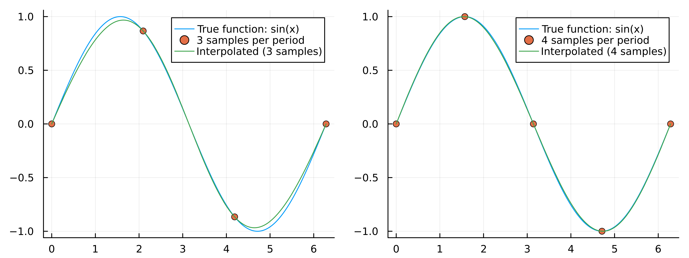

# ConvolutionInterpolations.jl

A high-performance Julia package for smooth N-dimensional interpolation on uniform grids using separable convolution kernels.

[](fig/convolution_interpolation_a_and_b.png)

## Why ConvolutionInterpolations.jl?

**Uniform Grids**: Designed specifically for uniformly-spaced data. Grid spacing can vary between dimensions, but must be uniform within each dimension.

**Performance**: Achieves true O(1) interpolation time independent of grid size through elimination of binary search operations. Novel discretized kernel approach with linear interpolation provides both speed and numerical stability. Allocation-free evaluation for maximum performance.

**Accuracy**: Novel b-series kernels (b5, b7, b9, b11, b13) discovered through systematic analytical search. The b5 kernel provides dramatically better accuracy than cubic splines at comparable computational cost - achieving 7th order convergence with quintic polynomial reproduction.

**Simplicity**: Minimal dependencies (LinearAlgebra, Serialization, Scratch for kernel caching). Clean API that scales naturally from 1D to arbitrary dimensions using separable convolution kernels.

## Features

- **N-dimensional interpolation**: Handles 1D to arbitrary dimensions using separable convolution kernels
- **Multiple kernel options**: From nearest neighbor to 13th-degree polynomials
- **Two kernel families**:
  - `:a` kernels: Literature-based kernels with minimal boundary handling
  - `:b` kernels: Novel high-accuracy kernels with 7th order convergence (b5 is default)
- **Flexible extrapolation**: Linear, flat, natural, periodic, and reflection boundary conditions
- **O(1) performance**: True constant-time interpolation independent of grid size
- **Performance optimized**: Precomputed kernels eliminate polynomial evaluation overhead
- **Uniform grids**: Sample data must be uniformly spaced in each dimension (spacing can vary between dimensions)
- **Optional smoothing**: Gaussian convolution kernel for noisy data

## Installation

```julia
using Pkg
Pkg.add("ConvolutionInterpolations")
```

## Quick Start

### 1D Interpolation

Interpolate a sine wave with just 3-4 samples per period:

```julia
using ConvolutionInterpolations
using Plots

# Sparse sampling: 3 samples per period
x = range(0, 2π, length=4)
y = sin.(x)
itp = convolution_interpolation(x, y)

x_fine = range(0, 2π, length=200)
p1 = plot(x_fine, sin.(x_fine), label="True function: sin(x)")
scatter!(p1, x, y, label="3 samples per period")
plot!(p1, x_fine, itp.(x_fine), label="Interpolated (3 samples)")

# Slightly denser: 4 samples per period
x = range(0, 2π, length=5)
y = sin.(x)
itp = convolution_interpolation(x, y)

p2 = plot(x_fine, sin.(x_fine), label="True function: sin(x)")
scatter!(p2, x, y, label="4 samples per period")
plot!(p2, x_fine, itp.(x_fine), label="Interpolated (4 samples)")

plot(p1, p2, layout=(1,2), size=(800,300), dpi=1000)
```

[](fig/simple_sine_wave_1D_demonstration.png)

### 2D Interpolation

Smooth interpolation of random data:

```julia
using Random
using ConvolutionInterpolations
using Plots

Random.seed!(123)
xs = range(-2, 2, length=10)
ys = range(-2, 2, length=10)
zs = rand(10, 10)

itp_2d = convolution_interpolation((xs, ys), zs)

xs_fine = range(-2, 2, length=100)
ys_fine = range(-2, 2, length=100)

p1 = contourf(xs, ys, zs', title="Original Data")
p2 = contourf(xs_fine, ys_fine, itp_2d.(xs_fine, ys_fine')', title="Interpolated")
plot(p1, p2, layout=(1,2), size=(800,300), dpi=1000)
```

[](fig/Smooth_random_2D_interpolation.png)

## Performance

ConvolutionInterpolations.jl delivers exceptional performance across dimensions while maintaining high accuracy.

### Accuracy: Runge Function Benchmark

The challenging 1D Runge function demonstrates the superior convergence of the b-series kernels:

[](fig/interpolation_1d_runge_64_bit.png)

**Key observations:**
- **b5 (fast)** achieves machine precision (~10⁻¹⁴) by 1000 sample points
- All b-series kernels significantly outperform cubic splines
- The "fast" implementation (with discretized kernels) matches or exceeds the "slow" (direct polynomial evaluation) in accuracy
- **7th order convergence verified**: The b-series kernels show a slope of approximately -7 on this log-log plot in their linear convergence region (20-100 points), confirming the 7th order accuracy derived from Taylor series analysis
- Cubic splines show the expected 4th order convergence (slope ~-4)
- Chebyshev interpolation shown for reference (requires non-uniform grid points)

### Speed: Initialization and Evaluation

Performance scales efficiently across dimensions:

[](fig/kernel_performance_comparison.png)

**Initialization time** (left panel): One-time cost for setting up the interpolator
- Dominated by boundary condition computation
- Linear kernels (a0, a1) initialize in ~76-78 μs
- Higher-order kernels scale with kernel complexity and boundary handling
- 4D b13 initialization: ~91 ms (still practical for most applications)

**Evaluation time** (right panel): Cost per interpolation
- O(1) scaling with respect to grid size - independent of number of sample points
- All fast kernel evaluations are allocation-free for optimal performance
- 1D b5: 15 ns per evaluation
- 2D b5: 88 ns per evaluation  
- 3D b5: 1.8 μs per evaluation
- Tensor product scaling: evaluation cost grows as (2×eqs)^N across dimensions

The b5 kernel offers the best accuracy-to-performance ratio for most applications.

## Advanced Usage

### Kernel Selection

Choose kernels based on your accuracy and smoothness requirements:

```julia
# Default: b5 kernel (excellent accuracy/performance balance)
itp = convolution_interpolation(x, y)  # degree=:b5, C3 continuous, 7th order accurate

# Low-order kernels
itp = convolution_interpolation(x, y; degree=:a0)  # Nearest neighbor
itp = convolution_interpolation(x, y; degree=:a1)  # Linear (C0 continuous)
itp = convolution_interpolation(x, y; degree=:a3)  # Cubic (C1 continuous)
itp = convolution_interpolation(x, y; degree=:b3)  # Cubic (C1 continuous)

# Higher-order a-series kernels (less boundary handling than b-series)
itp = convolution_interpolation(x, y; degree=:a5)  # Quintic
itp = convolution_interpolation(x, y; degree=:a7)  # Septic

# b-series kernels (superior accuracy, 7th order convergence)
itp = convolution_interpolation(x, y; degree=:b5)  # Quintic (C3 continuous, 7th order accurate)
itp = convolution_interpolation(x, y; degree=:b7)  # Septic (C5 continuous, 7th order accurate, optimal polynomial reproduction)
itp = convolution_interpolation(x, y; degree=:b9)  # 9th degree (C7 continuous, 7th order accurate)
itp = convolution_interpolation(x, y; degree=:b11) # 11th degree (C9 continuous, 7th order accurate)
itp = convolution_interpolation(x, y; degree=:b13) # 13th degree (C11 continuous, 7th order accurate)

# Gaussian smoothing (does not hit data points exactly)
itp = convolution_interpolation(x, y; B=1.0)  # B controls smoothing width
```

**Performance note**: The `:b` kernels (b5, b7, b9, b11, b13) all achieve 7th order convergence from a Taylor series perspective. For polynomial reproduction: b5 reproduces quintics exactly, b7 reproduces septics (degree 7) exactly, while higher order kernels cannot reproduce their own degrees. The b5 kernel represents the optimal balance - achieving excellent accuracy at reasonable computational cost, making it the default choice. The b7 kernel is optimal if exact polynomial reproduction up to degree 7 is required.

### Kernel Boundary Conditions

Control interpolation behavior near boundaries for optimal accuracy:

```julia
# Automatic (default, prioritizes :polynomial with fallback to :detect)
itp = convolution_interpolation(x, y; kernel_bc=:auto)

# Polynomial reproduction (optimal, requires sufficient grid points)
itp = convolution_interpolation(x, y; kernel_bc=:polynomial)

# Automatic detection (detects periodic signals, adaptive fallback)
itp = convolution_interpolation(x, y; kernel_bc=:detect)

# Manual selection
itp = convolution_interpolation(x, y; kernel_bc=:linear)    # Linear signals
itp = convolution_interpolation(x, y; kernel_bc=:quadratic) # Quadratic signals
itp = convolution_interpolation(x, y; kernel_bc=:periodic)  # Periodic signals
```

**Note**: The default `:auto` option prioritizes the `:polynomial` boundary condition (a novel contribution that computes optimal ghost point values by solving Vandermonde systems to preserve each kernel's polynomial reproduction properties), automatically falling back to `:detect` when there are insufficient grid points. The `:detect` option includes sophisticated periodic signal detection using precomputed linear predictors mixed with quadratic methods. The `:polynomial` method ensures b-series kernels maintain their 7th order convergence all the way to domain edges.

Per-dimension boundary conditions:

```julia
x = range(0, 1, length=10)
y = range(0, 1, length=10)
z = [sin(2π*xi) for xi in x, yi in y]

# Different boundary conditions for each dimension and boundary
kernel_bcs = [
    (:linear, :quadratic),  # First dimension: linear at start, quadratic at end
    (:periodic, :detect)    # Second dimension: periodic at start, auto-detect at end
]
itp = convolution_interpolation((x, y), z; kernel_bc=kernel_bcs)
```

### Extrapolation Methods

Define behavior outside the data domain:

```julia
# Error on out-of-bounds (default)
itp = convolution_interpolation(x, y; extrapolation_bc=Throw())

# Linear extrapolation
itp = convolution_interpolation(x, y; extrapolation_bc=Line())

# Constant (flat) extrapolation
itp = convolution_interpolation(x, y; extrapolation_bc=Flat())

# Natural extrapolation (highest continuity)
itp = convolution_interpolation(x, y; extrapolation_bc=Natural())

# Periodic extension
itp = convolution_interpolation(x, y; extrapolation_bc=Periodic())

# Reflection at boundaries
itp = convolution_interpolation(x, y; extrapolation_bc=Reflect())
```

### High-Dimensional Interpolation

Seamlessly handle data of arbitrary dimensionality:

```julia
# 4D interpolation (e.g., time-evolving 3D scalar field)
x = range(0, 1, length=10);
y = range(0, 1, length=10);
z = range(0, 1, length=10);
t = range(0, 1, length=5);

data_4d = [sin(2π*xi)*cos(2π*yi)*exp(-zi)*sqrt(ti) 
           for xi in x, yi in y, zi in z, ti in t];

itp_4d = convolution_interpolation((x, y, z, t), data_4d);

# Evaluate at arbitrary point
value = itp_4d(0.42, 0.33, 0.77, 0.51)
```

The separable kernel approach scales naturally to 5D, 6D, and beyond.

## Performance Optimization

### General Guidelines

1. **Default to `:b5`**: Optimal balance of accuracy and computational cost with 7th order convergence
2. **Higher `:b` kernels offer smoothness**: b7 (C⁵), b9 (C⁷), b11 (C⁹), b13 (C¹¹) all maintain 7th order convergence while providing increasingly smooth derivatives
3. **All kernels scale O(1)**: Interpolation time is independent of grid size thanks to elimination of binary search operations
4. **Switch to `:a` if needed**: Use `:a` kernels only if `:b` construction becomes too slow for very fine grids
5. **Lower degrees for high dimensions**: Minimize boundary handling overhead in 4D+ applications

### Fine-Tuning

The default settings are optimized for accuracy and performance:

```julia
# Default: fast mode with 100,000 precomputed kernel points
itp = convolution_interpolation(x, y)

# Disable fast mode (uses direct polynomial evaluation, slower but less memory)
itp = convolution_interpolation(x, y; fast=false)

# Reduce precompute resolution (rarely needed, O(1) lookup cost regardless)
itp = convolution_interpolation(x, y; precompute=10_000)
```

**Note**: The default `precompute=100_000` provides maximum accuracy. Lower values degrade interpolation quality with no performance benefit, so adjustment is rarely needed.

### Extrapolation Performance

- Use `Natural()` for maximum continuity in lower dimensions (1D-3D)
- Avoid `Natural()` in higher dimensions due to increased boundary handling
- `Line()` and `Flat()` are available alternatives

## Comparison with Other Packages

ConvolutionInterpolations.jl offers several advantages:

- **Novel b-series kernels**: Discovered through systematic analytical search, these kernels achieve 7th order convergence. The b7 kernel is optimal for polynomial reproduction (reproducing its own degree 7), while higher-degree kernels (b9-b13) provide increased smoothness without additional polynomial reproduction capability
- **Persistent kernel caching**: Discretized kernels are computed once and cached to disk using Scratch.jl, making subsequent loads nearly instantaneous
- **Kernel discretization with linear interpolation**: Novel approach that is both faster and more numerically stable than direct polynomial evaluation
- **Unified framework**: Single interface from nearest-neighbor to 13th-degree interpolation
- **Minimal dependencies**: Built primarily on Julia standard library (LinearAlgebra, Serialization) plus Scratch.jl for caching

## Technical Background

The b-series kernels (b5, b7, b9, b11, b13) represent original contributions discovered through systematic analytical search using symbolic computation. These kernels share several key properties:

- **7th order convergence**: All b-series kernels achieve 7th order accuracy from a Taylor series perspective
- **Polynomial reproduction**: b5 reproduces quintics, b7 reproduces septics (degree 7) and is the last kernel to reproduce its own degree. Higher-degree kernels (b9, b11, b13) max out at degree 7 reproduction
- **High continuity**: Ranging from C³ (b5) to C¹¹ (b13), providing extremely smooth interpolated functions
- **Optimal boundary handling**: Novel polynomial boundary condition method that solves Vandermonde systems to compute ghost point values, preserving polynomial reproduction properties at domain edges

The b5 kernel is the default due to its excellent balance of computational efficiency and accuracy. Higher-degree kernels offer increased smoothness while maintaining 7th order convergence.

**Extended precision**: For applications requiring accuracy beyond Float64 machine precision (~10⁻¹⁵), all kernels support BigFloat arithmetic. The analytical kernel coefficients are stored as exact rational numbers, enabling convergence well beyond standard machine precision when using extended precision types.

### Novel Implementation Approach

The implementation features a unique kernel evaluation strategy: rather than computing kernel polynomials directly via Horner's method, kernels are discretized at high resolution (default 100,000 points) and stored in a persistent cache. During interpolation, results are obtained through linear interpolation between the nearest convolutions of the data with these precomputed points. This approach offers several advantages:

- **Numerically superior**: Linear interpolation is more stable than polynomial evaluation
- **Persistent caching**: Computed once per kernel/precision combination using Scratch.jl, then reused across all sessions
- **Grid-agnostic**: Precomputed kernels are completely independent of user data or grid specifications
- **Fast initialization**: After first use, kernel loading from cache is nearly instantaneous

The implementation also achieves O(1) interpolation time through elimination of binary search operations, using direct index calculation on uniform grids.

## Acknowledgments

ConvolutionInterpolations.jl draws significant inspiration from [Interpolations.jl](https://github.com/JuliaMath/Interpolations.jl) in terms of API design and interface patterns. This package originally started as a PR for Interpolations.jl before evolving into a standalone implementation with novel kernel algorithms. I'm grateful to the Interpolations.jl maintainers and contributors for their excellent work.

The theoretical foundation builds on seminal work in convolution interpolation:

- R. G. Keys, "Cubic Convolution Interpolation for Digital Image Processing," *IEEE Transactions on Acoustics, Speech, and Signal Processing*, vol. 29, no. 6, pp. 1153-1160, December 1981.

- E. H. W. Meijering, K. J. Zuiderveld, and M. A. Viergever, "Image Reconstruction by Convolution with Symmetrical Piecewise nth-Order Polynomial Kernels," *IEEE Transactions on Image Processing*, vol. 8, no. 2, pp. 192-201, February 1999.

The novel b-series kernels (b5, b7, b9, b11, b13) represent original contributions discovered through a prolonged effort of systematic analytical search using symbolic computation (SymPy), by generalizing the approach of R. G. Keys. These kernels achieve 7th order convergence with varying degrees of polynomial reproduction and continuity classes. The performance optimizations, including O(1) interpolation through elimination of binary search operations and efficient precomputation strategies, were developed specifically for this package.

## License

This package is available under the MIT License.